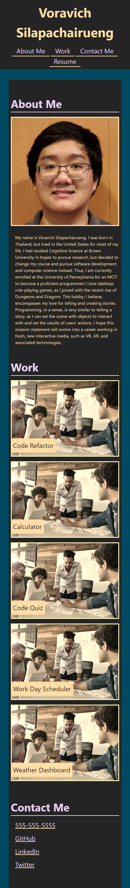
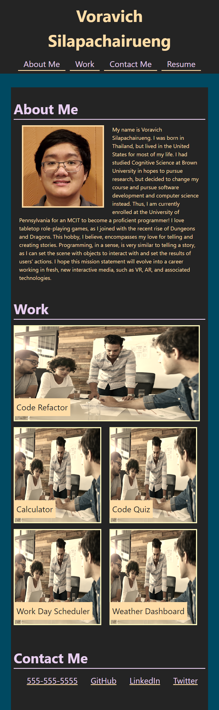
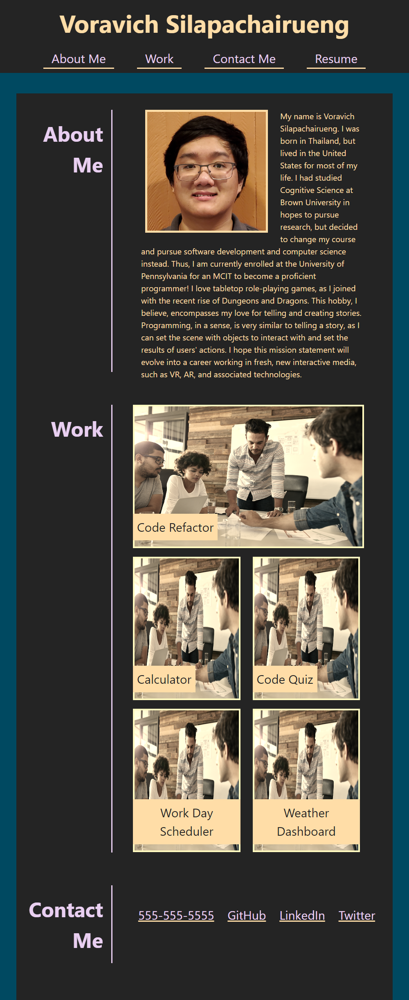

# professional-portfolio

## Description

This project is the start of a professional portfolio deployed on GitHub. It is an exercise in CSS and building a website from scratch using CSS, HTML, and Git. This project includes use of various CSS properties, such as pseudo-classes for hovering over and displaying objects, responsive design for websites to accomodate mobile, tablet, and desktop orientations, CSS variables, and various other properties. 

## Procedure and Challenges

I build from a boilerplate template drawn from the previous homework challenge, taking the structure of the HTML. I then added the reset.css file to reset the style to begin.

I outlined the necessary components from the mock-up screenshots provided, building incrementally form the top. At the very beginning, I used placeholder colors to mark the locations of each html element for layout purposes, then changed the colors later on.

The first major roadblock was the portrait image and its caption. This image had to be positioned inside the "About Me" section with the text wrapping around it. With some help, I got it working. Then, adding the caption required referencing lessons about absolute positioning and also required an image wrapper class. After perfecting this CSS for captions, it could be applied to the other captions easily.

Responsiveness was a large part of this project, and I decided to tackle it mobile-first. This allowed all elements to fall in a single column. Each section was a flex container that was a column in mobile and tablet sizes, and a row in desktop sizes. The work section also had to change, such that the first image is larger than the rest. My solution for this was admittedly sloppy, as I kept the first image stable with the next 4 images fell into a "work-panel-row" that was yet another flex container that ran horizontally. Thus, the work section had many nested flex containers that could likely be written cleaner, but with little time left, I leave it as is, functional but slightly sloppy in the background. The size of the work images suffers from this, as large monitor sizes does not allow the images to stretch like the mock-up does. In every other orientation, it is functional.

## Screenshots

* Mobile (600 px): 

* Tablet (800 px):

* Desktop (1000 px):

## Credits

Credit to https://css-tricks.com/slide-in-image-captions/ for teaching me about animating slide-in captions.

Credit to https://www.sitepoint.com/understanding-and-using-rem-units-in-css/ and mini-project 2 for information about implementing them.

Credit to https://www.geeksforgeeks.org/how-to-wrap-the-text-around-an-image-using-html-and-css/ to implementation of text wrapping.

The color scheme was drawn from: https://www.canva.com/colors/color-palettes/star-studded-sky/

## Github Deployed Site Link and Repository Link

Github Repository: https://github.com/voravichs/professional-portfolio

Github Pages Deployment: https://voravichs.github.io/professional-portfolio/